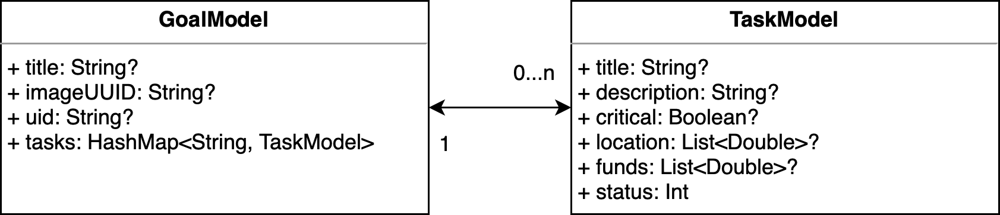

# goals-kotlin

a simple app that helps you accomplish your goals.

## Functionality

- Authentication using Firebase Authentication and FirebaseUI for Auth
- Storage of Goals and Tasks using Firebase Realtime Database and FirebaseUI for Realtime Database
- Storage of Images using Firebase Storage and FirebaseUI for Storage
- Map for picking locations using Google Maps SDK for Android

## Diagrams

## User- / Developer Experience

### User Experience

Given that the app itself is rather simple, I have decided against things like Nav Drawers, as I wanted the user experience to be as intuitive as possible.

I did however add swipe support to provide for a simpler way to e.g. delete goals.

### Developer Experience

I've tried to adhere to the UI & Material Design Guidelines whereever applicable. Given that this project is heavily reliant on Firebase technology, I also tried to leverage FirebaseUI whereever possible.

## Git

During this project, I tried to adopt a Trunk-Based Development approach (one branch per feature, which then get merged into the main branch).
However, given that I drew out the initial phase of prototyping / developing a proof of concept too far, only one of these feature-branches is now
actually visible in the git history.

## Personal statement

Personally, I've learned a lot through attending this course. Given that I myself am mostly using Apple devices, seeing how things work on the Android side of things really widened my horizon.

## References

- [FirebaseUI for Realtime Database](https://firebaseopensource.com/projects/firebase/firebaseui-android/database/readme/)
- [FirebaseUI for Storage](https://firebaseopensource.com/projects/firebase/firebaseui-android/storage/readme)
- [FirebaseUI for Auth](https://firebaseopensource.com/projects/firebase/firebaseui-android/auth/readme)
- [Google Maps SDK for Android overview](https://developers.google.com/maps/documentation/android-sdk/overview)
